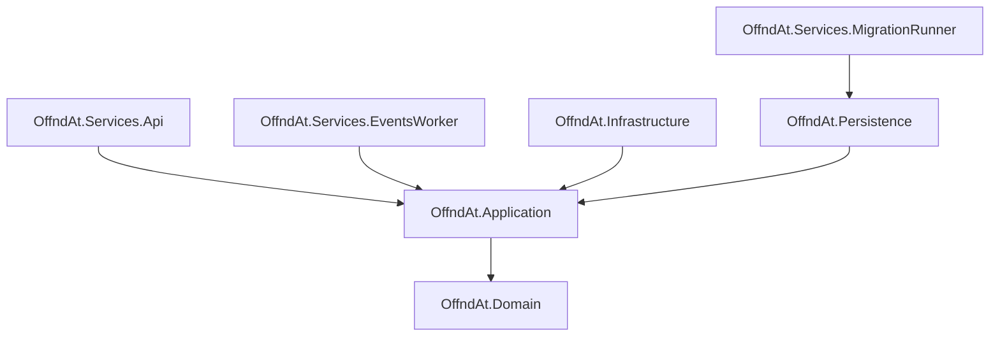

# offnd-at/backend-core

[](https://github.com/offnd-at/backend-core/actions)
[](https://github.com/offnd-at/backend-core/releases)


A robust, high-performance monolith backend for [offnd.at](https://offnd.at) - a profanity-first short link platform. Built with **Clean Architecture** and **Domain-Driven Design (DDD)**.

## Key Features

- **Link Management**: Create, manage, and track short links with custom phrases.
- **Analytics & Tracking**: Real-time visit tracking and analytics powered by integration events.
- **Modern Tech Stack**: Leveraging the latest .NET 10 features and PostgreSQL 17.
- **Scalable Messaging**: RabbitMQ integration via MassTransit for async background processing.
- **Observability**: Full OpenTelemetry support for metrics, tracing, and logging.
- **Developer-Friendly**: Built-in interactive documentation with Scalar (OpenAPI).

## Technology Stack

| Category | Technology |
| :--- | :--- |
| **Language** | C# 13 / .NET 10 |
| **Database** | PostgreSQL 17 / EF Core 10 |
| **Messaging** | MassTransit with RabbitMQ 4 |
| **Patterns** | CQRS (MediatR), Result Pattern, DDD |
| **Validation** | FluentValidation |
| **Testing** | xUnit, Bogus, FluentAssertions, Testcontainers |
| **Observability** | OpenTelemetry, Serilog |

## Architecture

The project follows the principles of Clean Architecture and DDD to ensure maintainability and scalability.




## Getting Started

### Prerequisites

- [.NET 10 SDK](https://dotnet.microsoft.com/download/dotnet/10.0)
- [Docker & Docker Compose](https://www.docker.com/products/docker-desktop)

### Quick Start

1. **Spin up local infrastructure**:
   ```powershell
   docker-compose up -d
   ```

2. **Explore the API**:
   Open `http://localhost:8090/docs/` to see the Scalar API reference.

## Contributing

Contributions are welcome! Feel free to create an issue or submit a pull request. You can also reach out to the project author at [contact@offnd.at](mailto:contact@offnd.at) with any questions or suggestions. 

If you'd like to help translate the short link profanity into your language, please check [offnd-at/vocabularies](https://github.com/offnd-at/vocabularies)!

---

Built with 🤬 by [ghawliczek](https://github.com/ghawliczek).
