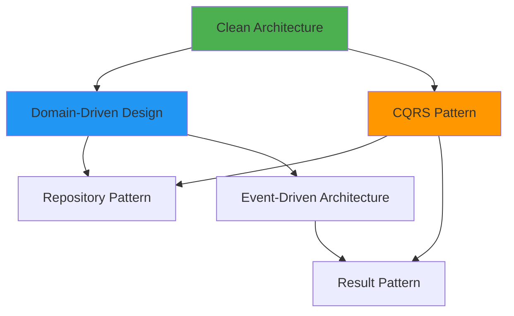
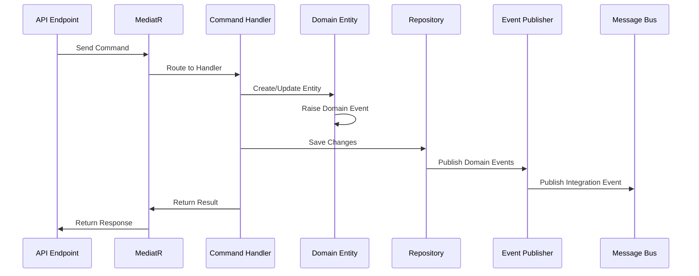

# Architectural Patterns

This document provides an overview of the key architectural patterns used in the offnd.at backend system. For detailed explanations of each pattern, see the individual pattern documentation in [`docs/patterns/`](../../docs/patterns/).

## Pattern Overview

The system employs several complementary patterns that work together to create a maintainable, scalable, and testable architecture:



## 1. Clean Architecture

**Purpose**: Organize code into layers with clear dependency rules

**Key Principles**:
- Dependencies point inward toward the domain
- Inner layers have no knowledge of outer layers
- Business logic is independent of frameworks

**Implementation**:
- **Domain Layer**: Core business rules (no dependencies)
- **Application Layer**: Use cases and workflows (depends on Domain)
- **Infrastructure Layer**: External services (depends on Application)
- **Presentation Layer**: API endpoints (depends on Application)

**Benefits**:
- ✅ Testable business logic
- ✅ Framework independence
- ✅ Clear separation of concerns
- ✅ Easy to understand and navigate

**Learn More**: [Clean Architecture Pattern](../../docs/patterns/clean-architecture.md)

---

## 2. Domain-Driven Design (DDD)

**Purpose**: Model complex business domains with rich, expressive code

**Key Concepts**:
- **Entities**: Objects with identity (e.g., `Link`)
- **Value Objects**: Immutable objects defined by attributes (e.g., `Url`, `Phrase`)
- **Aggregates**: Consistency boundaries (e.g., `Link` aggregate)
- **Domain Events**: Capture domain occurrences (e.g., `LinkCreatedDomainEvent`)
- **Ubiquitous Language**: Shared vocabulary between developers and domain experts

**Implementation**:
```csharp
// Aggregate Root
public sealed class Link : AggregateRoot<LinkId>
{
    public Phrase Phrase { get; }
    public Url TargetUrl { get; }
    public Language Language { get; }
    public Theme Theme { get; }
    
    public static Link Create(Phrase phrase, Url targetUrl, Language language, Theme theme)
    {
        var link = new Link(phrase, targetUrl, language, theme);
        link.RaiseDomainEvent(new LinkCreatedDomainEvent(link.Id, link.Language, link.Theme));
        return link;
    }
}

// Value Object
public sealed record Phrase
{
    public string Value { get; private init; }
    
    public static Result<Phrase> Create(string value)
    {
        // Validation logic
        return new Phrase { Value = value };
    }
}
```

**Benefits**:
- ✅ Rich domain model
- ✅ Encapsulated business rules
- ✅ Clear business intent
- ✅ Reduced coupling

**Learn More**: [Domain-Driven Design Pattern](../../docs/patterns/domain-driven-design.md)

---

## 3. CQRS (Command Query Responsibility Segregation)

**Purpose**: Separate read and write operations for clarity and optimization

**Key Concepts**:
- **Commands**: Write operations that change state
- **Queries**: Read operations that return data
- **Handlers**: Execute commands and queries
- **Separation**: Different models for reads and writes

**Implementation**:
```csharp
// Command
public sealed record GenerateLinkCommand(
    string TargetUrl,
    int LanguageId,
    int ThemeId,
    int FormatId) : ICommand<GenerateLinkResponse>;

// Command Handler
internal sealed class GenerateLinkCommandHandler 
    : ICommandHandler<GenerateLinkCommand, GenerateLinkResponse>
{
    public async Task<Result<GenerateLinkResponse>> Handle(
        GenerateLinkCommand request,
        CancellationToken cancellationToken)
    {
        // Business logic
    }
}

// Query
public sealed record GetLinkByPhraseQuery(string Phrase) : IQuery<LinkResponse>;

// Query Handler
internal sealed class GetLinkByPhraseQueryHandler 
    : IQueryHandler<GetLinkByPhraseQuery, LinkResponse>
{
    public async Task<Result<LinkResponse>> Handle(
        GetLinkByPhraseQuery request,
        CancellationToken cancellationToken)
    {
        // Data retrieval
    }
}
```

**Benefits**:
- ✅ Clear intent (read vs. write)
- ✅ Optimized for different concerns
- ✅ Scalable (can scale reads and writes independently)
- ✅ Easier to maintain

**Learn More**: [CQRS Pattern](../../docs/patterns/cqrs.md)

---

## 4. Result Pattern

**Purpose**: Explicit error handling without exceptions for control flow

**Key Concepts**:
- **Result<T>**: Represents success or failure
- **Error**: Strongly-typed error information
- **Railway-Oriented Programming**: Chain operations that can fail

**Implementation**:
```csharp
// Result type
public class Result<T>
{
    public bool IsSuccess { get; }
    public bool IsFailure => !IsSuccess;
    public T Value { get; }
    public Error Error { get; }
    
    public static Result<T> Success(T value) => new(value, true, Error.None);
    public static Result<T> Failure(Error error) => new(default, false, error);
}

// Usage
public async Task<Result<Link>> GetLinkAsync(Phrase phrase)
{
    var link = await _repository.GetByPhraseAsync(phrase);
    
    return link.HasValue
        ? Result.Success(link.Value)
        : Result.Failure<Link>(DomainErrors.Link.NotFound);
}
```

**Benefits**:
- ✅ Explicit error handling
- ✅ Type-safe errors
- ✅ Better performance (no exceptions)
- ✅ Composable operations

**Learn More**: [Result Pattern](../../docs/patterns/result-pattern.md)

---

## 5. Repository Pattern

**Purpose**: Abstract data access logic from business logic

**Key Concepts**:
- **Interface in Domain**: Repository contracts defined in domain layer
- **Implementation in Infrastructure**: Concrete implementations in persistence layer
- **Aggregate-Oriented**: One repository per aggregate root

**Implementation**:
```csharp
// Interface (in Domain layer)
public interface ILinkRepository
{
    Task<Maybe<Link>> GetByIdAsync(LinkId id, CancellationToken cancellationToken = default);
    Task<Maybe<Link>> GetByPhraseAsync(Phrase phrase, CancellationToken cancellationToken = default);
    void Insert(Link link);
    void Update(Link link);
    void Delete(Link link);
}

// Implementation (in Persistence layer)
internal sealed class LinkRepository(OffndAtDbContext context) : ILinkRepository
{
    public async Task<Maybe<Link>> GetByPhraseAsync(
        Phrase phrase,
        CancellationToken cancellationToken = default)
    {
        var link = await context.Links
            .FirstOrDefaultAsync(l => l.Phrase == phrase, cancellationToken);
        
        return link ?? Maybe<Link>.None;
    }
    
    public void Insert(Link link) => context.Links.Add(link);
}
```

**Benefits**:
- ✅ Testable business logic (can mock repositories)
- ✅ Centralized data access
- ✅ Database independence
- ✅ Consistent query patterns

**Learn More**: [Repository Pattern](../../docs/patterns/repository-pattern.md)

---

## 6. Event-Driven Architecture

**Purpose**: Decouple components through asynchronous event communication

**Key Concepts**:
- **Domain Events**: In-process events within the same transaction
- **Integration Events**: Cross-service events via message bus
- **Event Handlers**: React to events
- **Eventual Consistency**: Accept temporary inconsistency for scalability

**Implementation**:
```csharp
// Domain Event
public sealed record LinkCreatedDomainEvent(LinkId LinkId) : IDomainEvent;

// Domain Event Handler
internal sealed class LinkCreatedDomainEventHandler(
    IPublishEndpoint publishEndpoint)
    : IDomainEventHandler<LinkCreatedDomainEvent>
{
    public async Task Handle(
        LinkCreatedDomainEvent notification,
        CancellationToken cancellationToken)
    {
        // Publish integration event
        await publishEndpoint.Publish(
            new LinkCreatedIntegrationEvent(notification.LinkId.Value),
            cancellationToken);
    }
}

// Integration Event
public sealed record LinkCreatedIntegrationEvent
{
    public Guid LinkId { get; init; }
    public DateTime CreatedAtUtc { get; init; }
}

// Integration Event Consumer
public sealed class LinkCreatedIntegrationEventConsumer 
    : IConsumer<LinkCreatedIntegrationEvent>
{
    public async Task Consume(ConsumeContext<LinkCreatedIntegrationEvent> context)
    {
        // Process event
    }
}
```

**Event Flow**:
1. Aggregate raises domain event
2. Domain event handler executes (same transaction)
3. Integration event published to RabbitMQ
4. Background worker consumes integration event
5. Asynchronous processing completes

**Benefits**:
- ✅ Loose coupling
- ✅ Scalability
- ✅ Asynchronous processing
- ✅ Audit trail

**Learn More**: [Event-Driven Architecture Pattern](../../docs/patterns/event-driven-architecture.md)

---

## 7. Dependency Injection

**Purpose**: Invert dependencies and enable testability

**Key Concepts**:
- **Constructor Injection**: Dependencies injected via constructor
- **Interface-Based**: Depend on abstractions, not concretions
- **Lifetime Management**: Singleton, Scoped, Transient
- **Service Registration**: Extension methods per layer

**Implementation**:
```csharp
// Service interface
public interface IPhraseGenerator
{
    Task<Result<Phrase>> GenerateAsync(
        Format format,
        Language language,
        Theme theme,
        CancellationToken cancellationToken = default);
}

// Service implementation
internal sealed class PhraseGenerator : IPhraseGenerator
{
    // Implementation
}

// Registration
public static class DependencyInjectionExtensions
{
    public static IServiceCollection AddApplication(this IServiceCollection services)
    {
        services.AddScoped<IPhraseGenerator, PhraseGenerator>();
        return services;
    }
}

// Usage (constructor injection with primary constructor)
internal sealed class GenerateLinkCommandHandler(
    IPhraseGenerator phraseGenerator,
    ILinkRepository linkRepository)
    : ICommandHandler<GenerateLinkCommand, GenerateLinkResponse>
{
    // Dependencies automatically injected
}
```

**Benefits**:
- ✅ Testability (easy to mock dependencies)
- ✅ Flexibility (swap implementations)
- ✅ Loose coupling
- ✅ Centralized configuration

**Learn More**: [Dependency Injection Pattern](../../docs/patterns/dependency-injection.md)

---

## Pattern Interactions

### How Patterns Work Together



### Pattern Synergies

1. **Clean Architecture + DDD**: Domain layer contains pure business logic, outer layers handle infrastructure concerns

2. **CQRS + Repository**: Commands and queries use repositories to access data, but can optimize differently

3. **DDD + Event-Driven**: Domain events capture business occurrences, integration events enable cross-service communication

4. **Result Pattern + CQRS**: All commands and queries return `Result<T>` for consistent error handling

5. **Dependency Injection + All Patterns**: Enables testability and flexibility across all layers

## Anti-Patterns to Avoid

### ❌ Anemic Domain Model
**Problem**: Domain entities with no behavior, just getters/setters

**Solution**: Encapsulate business logic in domain entities

### ❌ Leaky Abstractions
**Problem**: Infrastructure concerns leak into domain layer

**Solution**: Use interfaces and dependency inversion

### ❌ God Objects
**Problem**: Single class doing too much

**Solution**: Follow Single Responsibility Principle, use aggregates

### ❌ Exception-Driven Flow
**Problem**: Using exceptions for control flow

**Solution**: Use Result pattern for expected failures

### ❌ Direct Database Access in Handlers
**Problem**: Command handlers directly using DbContext

**Solution**: Use repository pattern for data access

## Pattern Selection Guide

| Scenario | Recommended Pattern |
|----------|-------------------|
| Organizing code layers | Clean Architecture |
| Modeling complex business logic | Domain-Driven Design |
| Separating reads and writes | CQRS |
| Handling errors explicitly | Result Pattern |
| Abstracting data access | Repository Pattern |
| Decoupling components | Event-Driven Architecture |
| Managing dependencies | Dependency Injection |

## Next Steps

For detailed explanations and examples of each pattern:
- [Clean Architecture](../../docs/patterns/clean-architecture.md)
- [Domain-Driven Design](../../docs/patterns/domain-driven-design.md)
- [CQRS](../../docs/patterns/cqrs.md)
- [Result Pattern](../../docs/patterns/result-pattern.md)
- [Repository Pattern](../../docs/patterns/repository-pattern.md)
- [Event-Driven Architecture](../../docs/patterns/event-driven-architecture.md)
- [Dependency Injection](../../docs/patterns/dependency-injection.md)
