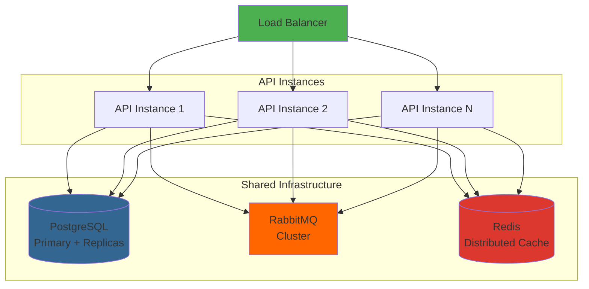
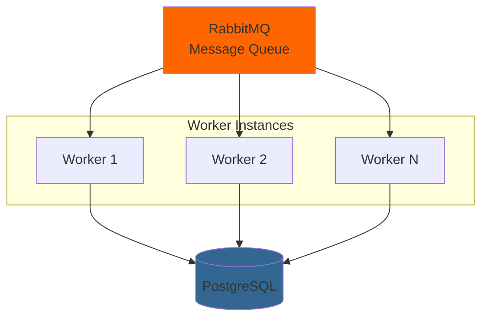
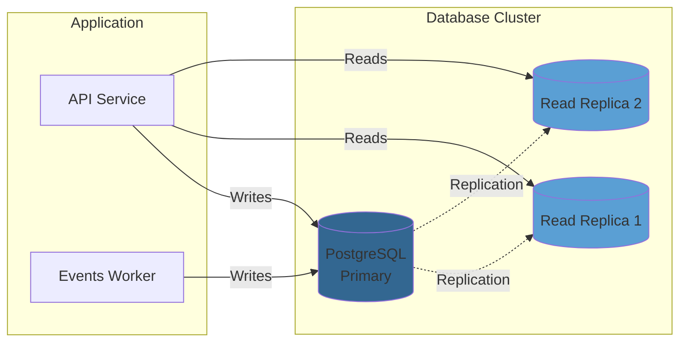
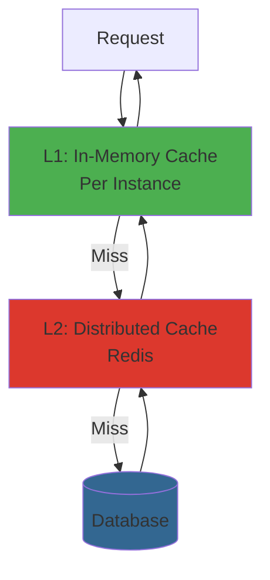
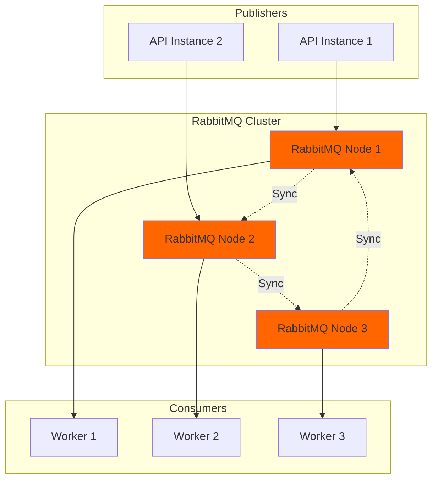
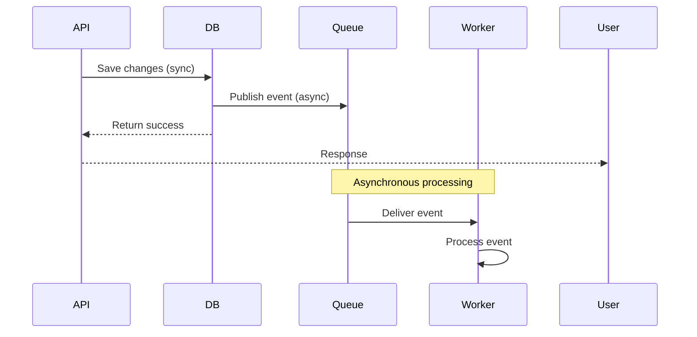
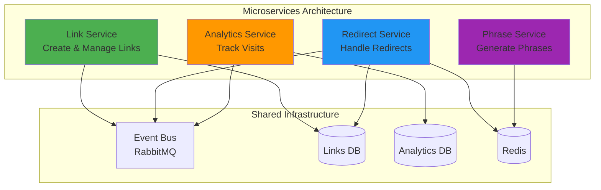
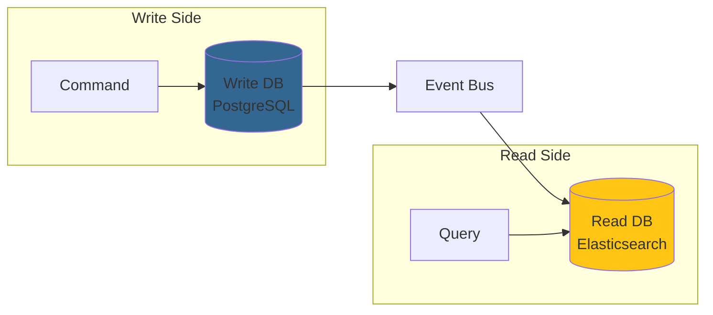

# Scalability Considerations

This document outlines the scalability strategies, patterns, and considerations built into the offnd.at backend architecture.

## Current Architecture Scalability

### Monolithic Design with Scalability in Mind

While the system is currently a monolith, it's designed with scalability principles that enable:
- **Horizontal scaling** of the API service
- **Independent scaling** of background workers
- **Database optimization** for high-throughput operations
- **Caching strategies** to reduce database load
- **Asynchronous processing** for non-critical operations

## Horizontal Scaling Strategies

### API Service Scaling



**Scalability Features**:
- ✅ **Stateless API**: No session state stored in API instances
- ✅ **Shared cache**: Distributed cache (Redis) for cross-instance consistency
- ✅ **Load balancing**: Round-robin or least-connections distribution
- ✅ **Health checks**: `/health` endpoint for load balancer monitoring

**Configuration**:
```yaml
# docker-compose.yaml (production-ready example)
services:
  api:
    image: offndat/api:latest
    deploy:
      replicas: 3
      resources:
        limits:
          cpus: '1'
          memory: 512M
    environment:
      - ConnectionStrings__Database=Host=postgres;Database=offndat
      - RabbitMQ__Host=rabbitmq
      - Redis__ConnectionString=redis:6379
```

### Background Worker Scaling



**Scalability Features**:
- ✅ **Competing consumers**: Multiple workers process messages concurrently
- ✅ **Message acknowledgment**: Ensures at-least-once delivery
- ✅ **Prefetch limits**: Controls concurrent message processing per worker
- ✅ **Automatic retry**: Failed messages are retried with exponential backoff

**Configuration**:
```csharp
// MassTransit configuration for scalability
x.UsingRabbitMq((context, cfg) =>
{
    cfg.PrefetchCount = 16; // Process up to 16 messages concurrently
    cfg.ConcurrentMessageLimit = 32; // Limit concurrent processing
    
    cfg.UseMessageRetry(r => r.Incremental(
        retryLimit: 3,
        initialInterval: TimeSpan.FromSeconds(1),
        intervalIncrement: TimeSpan.FromSeconds(2)));
});
```

## Database Scalability

### Read Replicas



**Strategy**:
- **Writes**: Always go to primary database
- **Reads**: Distributed across read replicas
- **CQRS alignment**: Queries use replicas, commands use primary

**Implementation**:
```csharp
// DbContext configuration for read replicas
services.AddDbContext<OffndAtDbContext>((sp, options) =>
{
    var isReadOperation = sp.GetService<IHttpContextAccessor>()
        ?.HttpContext?.Request.Method == "GET";
    
    var connectionString = isReadOperation
        ? configuration.GetConnectionString("DatabaseReadReplica")
        : configuration.GetConnectionString("Database");
    
    options.UseNpgsql(connectionString);
});
```

### Database Optimization

**Indexing Strategy**:
```sql
-- Unique index on phrase for fast lookups
CREATE UNIQUE INDEX idx_links_phrase ON links(phrase);

-- Index on created_at for time-based queries
CREATE INDEX idx_links_created_at ON links(created_at_utc);

-- Composite index for language/theme filtering
CREATE INDEX idx_links_language_theme ON links(language_id, theme_id);
```

**Connection Pooling**:
```csharp
// EF Core connection pooling
services.AddDbContextPool<OffndAtDbContext>(options =>
{
    options.UseNpgsql(connectionString, npgsqlOptions =>
    {
        npgsqlOptions.MinBatchSize(1);
        npgsqlOptions.MaxBatchSize(100);
        npgsqlOptions.CommandTimeout(30);
    });
}, poolSize: 128); // Pool up to 128 contexts
```

## Caching Strategies

### Multi-Level Caching



**Cache Levels**:

1. **L1 - In-Memory Cache** (per instance):
   - Fastest access
   - Limited size (configurable)
   - Instance-specific
   - TTL: 5-60 seconds

2. **L2 - Distributed Cache** (Redis):
   - Shared across instances
   - Larger capacity
   - Consistent across API instances
   - TTL: 1-60 minutes

**Implementation**:
```csharp
// Multi-level cache implementation
public sealed class LinkVisitCache(
    IMemoryCache memoryCache,
    IDistributedCache distributedCache) : ILinkVisitCache
{
    public async Task<bool> HasVisitedAsync(LinkId linkId, string visitorId)
    {
        var key = $"visit:{linkId}:{visitorId}";
        
        // Check L1 cache
        if (memoryCache.TryGetValue(key, out _))
            return true;
        
        // Check L2 cache
        var distributedValue = await distributedCache.GetAsync(key);
        if (distributedValue != null)
        {
            // Populate L1 cache
            memoryCache.Set(key, true, TimeSpan.FromSeconds(30));
            return true;
        }
        
        return false;
    }
    
    public async Task MarkAsVisitedAsync(LinkId linkId, string visitorId, TimeSpan expiration)
    {
        var key = $"visit:{linkId}:{visitorId}";
        
        // Set in both caches
        memoryCache.Set(key, true, expiration);
        await distributedCache.SetAsync(key, [1], new DistributedCacheEntryOptions
        {
            AbsoluteExpirationRelativeToNow = expiration
        });
    }
}
```

### Cache Invalidation

**Strategies**:
- **TTL-based**: Automatic expiration after time period
- **Event-based**: Invalidate on domain events
- **Pattern-based**: Clear related cache entries

```csharp
// Event-based cache invalidation
internal sealed class LinkUpdatedDomainEventHandler(
    IDistributedCache cache) : IDomainEventHandler<LinkUpdatedDomainEvent>
{
    public async Task Handle(LinkUpdatedDomainEvent notification, CancellationToken cancellationToken)
    {
        // Invalidate cache for this link
        await cache.RemoveAsync($"link:{notification.LinkId}", cancellationToken);
        await cache.RemoveAsync($"link:phrase:{notification.Phrase}", cancellationToken);
    }
}
```

## Rate Limiting

### Fixed Window Rate Limiting

```csharp
// Rate limiting configuration
services.AddRateLimiter(options =>
{
    options.GlobalLimiter = PartitionedRateLimiter.Create<HttpContext, string>(context =>
    {
        var userId = context.User.Identity?.Name ?? context.Connection.RemoteIpAddress?.ToString() ?? "anonymous";
        
        return RateLimitPartition.GetFixedWindowLimiter(userId, _ => new FixedWindowRateLimiterOptions
        {
            PermitLimit = 100,
            Window = TimeSpan.FromMinutes(1),
            QueueProcessingOrder = QueueProcessingOrder.OldestFirst,
            QueueLimit = 10
        });
    });
});
```

**Limits**:
- **Anonymous users**: 100 requests/minute
- **Authenticated users**: 1000 requests/minute (configurable)
- **Burst protection**: Queue up to 10 requests

## Message Queue Scalability

### RabbitMQ Clustering



**Features**:
- **High availability**: Queue mirroring across nodes
- **Load distribution**: Messages distributed across cluster
- **Fault tolerance**: Automatic failover

## Performance Optimizations

### Phrase Generation with Retry Policy

The phrase generation uses Polly resilience policies to handle collisions efficiently:

```csharp
// Resilience pipeline for phrase generation
services.AddResiliencePipeline<string, Result<Phrase>>(
    ResiliencePolicies.PhraseAlreadyInUsePolicyName,
    builder => builder
        .AddRetry(new RetryStrategyOptions<Result<Phrase>>
        {
            MaxRetryAttempts = 5,
            BackoffType = DelayBackoffType.Exponential,
            UseJitter = true,
            ShouldHandle = new PredicateBuilder<Result<Phrase>>()
                .HandleResult(r => r.IsFailure && r.Error == DomainErrors.Phrase.AlreadyInUse)
        }));
```

**Benefits**:
- Handles phrase collisions gracefully
- Exponential backoff prevents database hammering
- Jitter prevents thundering herd

### Asynchronous Processing

**Domain Events → Integration Events**:


**Benefits**:
- Fast API response times
- Non-blocking operations
- Improved throughput

## Monitoring and Observability

### Metrics for Scalability

```csharp
// Custom metrics for monitoring scalability
public sealed class ScalabilityMetrics
{
    private readonly Counter<long> _requestCounter;
    private readonly Histogram<double> _requestDuration;
    private readonly Gauge<int> _activeConnections;
    
    public ScalabilityMetrics(IMeterFactory meterFactory)
    {
        var meter = meterFactory.Create("OffndAt.Scalability");
        
        _requestCounter = meter.CreateCounter<long>(
            "requests_total",
            description: "Total number of requests");
        
        _requestDuration = meter.CreateHistogram<double>(
            "request_duration_seconds",
            description: "Request duration in seconds");
        
        _activeConnections = meter.CreateGauge<int>(
            "active_connections",
            description: "Number of active database connections");
    }
}
```

**Key Metrics**:
- Request throughput (requests/second)
- Response time percentiles (p50, p95, p99)
- Database connection pool usage
- Cache hit ratio
- Message queue depth
- Worker processing rate

## Bottleneck Analysis

### Potential Bottlenecks

| Component | Bottleneck | Mitigation |
|-----------|-----------|------------|
| **Database** | Write throughput | Connection pooling, batch operations, async processing |
| **Phrase Generation** | Collision rate | Retry policy, larger phrase space, caching |
| **API Instances** | CPU/Memory | Horizontal scaling, resource limits |
| **Message Queue** | Queue depth | More workers, batch processing |
| **Cache** | Memory limits | Distributed cache (Redis), eviction policies |

### Database Write Optimization

```csharp
// Batch insert optimization
public async Task InsertBatchAsync(IEnumerable<Link> links, CancellationToken cancellationToken)
{
    await using var transaction = await _context.Database.BeginTransactionAsync(cancellationToken);
    
    try
    {
        _context.Links.AddRange(links);
        await _context.SaveChangesAsync(cancellationToken);
        await transaction.CommitAsync(cancellationToken);
    }
    catch
    {
        await transaction.RollbackAsync(cancellationToken);
        throw;
    }
}
```

## Future Scalability Paths

### Microservices Decomposition

If the monolith reaches scalability limits, it can be decomposed:



**Decomposition Strategy**:
1. **Link Service**: Link creation and management
2. **Redirect Service**: High-throughput redirect handling
3. **Analytics Service**: Visit tracking and statistics
4. **Phrase Service**: Phrase generation (stateless)

### Event Sourcing

For high-scale analytics, consider event sourcing:

```csharp
// Event store for link visits
public sealed record LinkVisitEvent(
    Guid LinkId,
    string VisitorId,
    DateTimeOffset VisitedAt,
    string UserAgent,
    string IpAddress);

// Append-only event store
public interface IEventStore
{
    Task AppendAsync(LinkVisitEvent @event, CancellationToken cancellationToken);
    IAsyncEnumerable<LinkVisitEvent> GetEventsAsync(Guid linkId);
}
```

**Benefits**:
- Complete audit trail
- Temporal queries
- Rebuild state from events
- High write throughput

### CQRS with Separate Read Models



**Benefits**:
- Optimized read models (denormalized)
- Independent scaling of reads and writes
- Specialized databases for different workloads

## Scalability Testing

### Load Testing Strategy

```bash
# Using k6 for load testing
k6 run --vus 100 --duration 30s load-test.js
```

**Test Scenarios**:
1. **Link Creation**: 100 concurrent users creating links
2. **Redirect**: 1000 concurrent redirects
3. **Mixed Workload**: 70% reads, 30% writes
4. **Spike Test**: Sudden traffic increase
5. **Stress Test**: Find breaking point

### Performance Targets

| Metric | Target | Current |
|--------|--------|---------|
| **API Response Time (p95)** | < 200ms | ~150ms |
| **Redirect Response Time (p95)** | < 50ms | ~30ms |
| **Throughput** | > 1000 req/s | ~800 req/s |
| **Database Connections** | < 100 | ~50 |
| **Cache Hit Ratio** | > 80% | ~85% |
| **Message Processing** | < 1s | ~500ms |

## Conclusion

The offnd.at backend is designed with scalability as a core principle:

✅ **Horizontal scaling** ready for API and workers  
✅ **Caching strategies** to reduce database load  
✅ **Asynchronous processing** for non-critical operations  
✅ **Database optimization** with indexing and pooling  
✅ **Monitoring** to identify bottlenecks  
✅ **Clear migration path** to microservices if needed  

The current monolithic architecture can handle significant scale, and the clean architecture principles ensure that future decomposition is straightforward if required.
