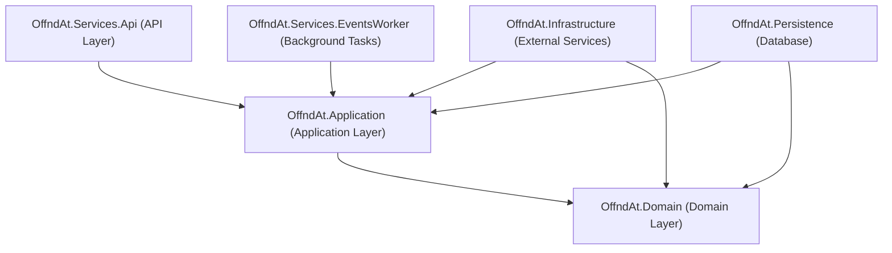

# Agent Documentation for offnd-at/backend-core

Welcome, Agent! This document provides the necessary context and guidelines to help you work effectively with the `offnd-at/backend-core` repository.

## Project Overview
This repository contains the backend core for [offnd.at](https://offnd.at), a platform for short links. It is built as a .NET monolith following **Clean Architecture** principles and **Domain-Driven Design (DDD)**.

## High-Level Architecture



## Project Structure

- **OffndAt.Domain**: The core of the system. Contains entities, value objects, domain events, and repository interfaces. No dependencies on other projects.
- **OffndAt.Application**: Contains business logic, CQRS commands/queries, and domain event handlers. Depends on Domain.
- **OffndAt.Infrastructure**: Implements external services like messaging (MassTransit), logging (Serilog), and telemetry (OpenTelemetry).
- **OffndAt.Persistence**: Handles database access using EF Core and PostgreSQL. Contains migrations and repository implementations.
- **OffndAt.Services.Api**: The entry point for the web application. Defines RESTful endpoints and sets up DI.
- **OffndAt.Services.EventsWorker**: A background worker that consumes integration events from RabbitMQ.
- **OffndAt.Contracts**: Shared DTOs and contracts used across the application.

## Technology Stack

- **Runtime**: .NET 10
- **Database**: PostgreSQL 17
- **ORM**: Entity Framework Core 10
- **Messaging**: MassTransit with RabbitMQ 4
- **CQRS**: MediatR
- **Validation**: FluentValidation
- **Observability**: OpenTelemetry (Metrics, Tracing, Logging)
- **Documentation**: Scalar (OpenAPI)
- **Testing**: xUnit, Bogus, FluentAssertions, Testcontainers

## Patterns & Conventions

### CQRS & Result Pattern
We use MediatR for Command and Query separation. Handlers return a `Result` or `Result<T>` object to handle success and failure flows without using exceptions for control flow.

### DDD & Events
- **Aggregates & Entities**: Use `AggregateRoot` and `Entity` base classes.
- **Domain Events**: Handled within the same request/transaction using MediatR. Typically used to record metrics or publish integration events.
- **Integration Events**: Published to RabbitMQ via MassTransit for async processing or cross-service communication.
- **Strongly Typed IDs**: Entities use custom `EntityId` records for type safety.

### Coding Style
- **File-scoped Namespaces**: Use `namespace MyNamespace;`.
- **Primary Constructors**: Prefer primary constructors for dependencies.
- **Sealed Classes**: Mark handlers and services as `sealed`.
- **Interface Naming**: Always prefix with `I` (e.g., `ILinkRepository`).

## Development Setup

The project uses Docker for local development dependencies:
```powershell
docker-compose up -d
```
This starts PostgreSQL, RabbitMQ, and the Otel Collector.

## Common Workflows

### Adding a New Endpoint
1. Define a Command/Query in `OffndAt.Application`.
2. Implement the Handler in `OffndAt.Application`.
3. Create an `IEndpoint` implementation in `OffndAt.Services.Api/Endpoints/Vx`. 
   - **Note**: Endpoints are automatically registered and mapped based on the `IEndpoint` interface and folder structure.

### Creating a New Domain Event
1. Define the event in `OffndAt.Domain/Events`.
2. Raise the event in the Aggregate/Entity.
3. (Optional) Create a handler in `OffndAt.Application` to publish an Integration Event.

---
> [!TIP]
> Always check existing implementations (e.g., `GetLinkByPhrase`) as a reference for patterns and structure.
