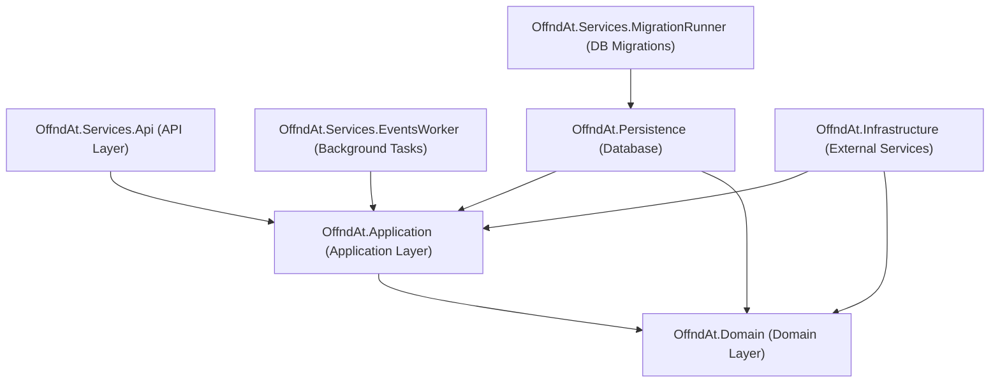

# Agent Documentation for offnd-at/backend-core

Welcome, Agent! This document provides the necessary context and guidelines to help you work effectively with the `offnd-at/backend-core` repository.

## Project Overview
This repository contains the backend core for [offnd.at](https://offnd.at), a profanity-first platform for short links. It is built as a .NET monolith following **Clean Architecture** principles and **Domain-Driven Design (DDD)**. It aims for a "good-enough-performance" balanced with high maintainability.

## High-Level Architecture

## Project Structure

- **OffndAt.Domain**: The core of the system. Contains entities, value objects, domain events, and repository interfaces. No dependencies on other projects.
- **OffndAt.Application**: Contains business logic, CQRS commands/queries, and domain event handlers. Depends on Domain.
- **OffndAt.Infrastructure**: Implements external services like messaging (MassTransit), logging (Serilog), and telemetry (OpenTelemetry).
- **OffndAt.Persistence**: Handles database access using EF Core and PostgreSQL. Contains migrations and repository implementations.
- **OffndAt.Services.Api**: The entry point for the web application. Defines RESTful endpoints and sets up DI.
- **OffndAt.Services.EventsWorker**: A background worker that consumes integration events from RabbitMQ.
- **OffndAt.Services.MigrationRunner**: A dedicated service for running database migrations using EF Core.
- **OffndAt.Contracts**: Shared DTOs and contracts used across the application.

## Technology Stack

- **Runtime**: .NET 10
- **Database**: PostgreSQL 17
- **ORM**: Entity Framework Core 10
- **Messaging**: MassTransit with RabbitMQ 4
- **CQRS**: MediatR
- **Validation**: FluentValidation
- **Observability**: OpenTelemetry (Metrics, Tracing, Logging)
- **Documentation**: Scalar (OpenAPI)
- **Testing**: NUnit, Bogus, FluentAssertions, Testcontainers

## Patterns & Conventions

### CQRS & Result Pattern
We use MediatR for Command and Query separation. Handlers return a `Result` or `Result<T>` object to handle success and failure flows without using exceptions for control flow.

### DDD & Events
- **Aggregates & Entities**: Use `AggregateRoot` and `Entity` base classes.
- **Domain Events**: Handled within the same request/transaction using MediatR. Typically used to record metrics or publish integration events.
- **Integration Events**: Published to RabbitMQ via MassTransit for async processing or cross-service communication.
- **Strongly Typed IDs**: Entities use custom `EntityId` records for type safety.

### Coding Style
- **File-scoped Namespaces**: Use `namespace MyNamespace;`.
- **Primary Constructors**: Always prefer primary constructors for dependencies.
- **Sealed Classes**: Mark handlers, services, and internal classes as `sealed`.
- **Interface Naming**: Always prefix with `I` (e.g., `ILinkRepository`).
- **Expression-bodied Members**: Prefer expression-bodied members (`=>`) for short methods, properties, and constructors when applicable.
- **`var` Usage**: Use `var` when the type is apparent from the right side of the assignment (e.g., `var x = new MyType();`) or for built-in types.
- **Namespace Placement**: Place `using` directives outside the namespace.
- **Line Length**: Aim for a maximum line length of 140 characters.
- **Folder Structure**: Organize `OffndAt.Application` and `OffndAt.Services.Api` by feature folders (e.g., `Links/Commands`, `Links/Queries`, `Endpoints/V1`).

## Agent-Specific Context

### How to Help
When working on this repository, you should:
1.  **Check `Program.cs`**: Start with `OffndAt.Services.Api/Program.cs` to understand the application setup and middleware pipeline.
2.  **DI Registration**: Look at `DependencyInjectionExtensions.cs` files in each project to see how services are registered.
3.  **CQRS Discovery**: To find the logic for a specific feature, search for the Command or Query name. Handlers are typically located in the same or a nearby folder.
4.  **Verification**: Always run tests after making changes. The solution contains unit, integration, and functional tests.

### Navigation Tips
- Use `grep` to find implementations of `ICommandHandler<TCommand>` or `IQueryHandler<TQuery, TResult>`.
- Check `OffndAt.Services.Api/Endpoints` for the entry points of API requests.

---
> [!TIP]
> Always check existing implementations (e.g., `GetLinkByPhrase`) as a reference for patterns and structure.
