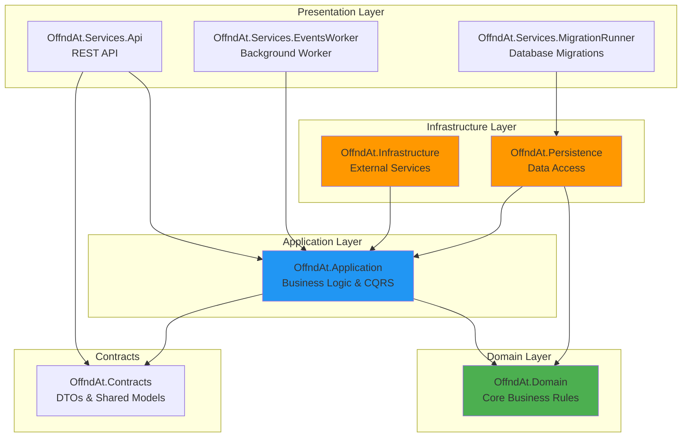

# Project Architecture Overview

## Introduction

**offnd.at/backend-core** is a .NET monolithic backend for a profanity-first URL shortener platform. The system is designed following **Clean Architecture** principles and **Domain-Driven Design (DDD)** to achieve a balance between high performance and maintainability.

## Core Principles

### Clean Architecture
The project strictly adheres to Clean Architecture principles:
- **Dependency Rule**: Dependencies point inward toward the domain
- **Independence**: Business logic is independent of frameworks, UI, and external services
- **Testability**: Core business logic can be tested without external dependencies

### Domain-Driven Design
The system is organized around the business domain:
- **Ubiquitous Language**: Shared vocabulary between developers and domain experts
- **Bounded Contexts**: Clear boundaries around domain concepts
- **Aggregates**: Consistency boundaries for domain entities

## High-Level Architecture

The system is organized into distinct layers, each with specific responsibilities:



## Layer Responsibilities

### Domain Layer (`OffndAt.Domain`)
**Purpose**: Contains the core business logic and rules

**Key Components**:
- Entities and Aggregate Roots (e.g., `Link`)
- Value Objects (e.g., `Url`, `Phrase`)
- Domain Events (e.g., `LinkCreatedDomainEvent`)
- Repository Interfaces
- Domain Services
- Enumerations (e.g., `Language`, `Theme`, `Format`)

**Dependencies**: None (pure business logic)

### Application Layer (`OffndAt.Application`)
**Purpose**: Orchestrates business workflows and use cases

**Key Components**:
- CQRS Commands and Queries
- Command/Query Handlers
- Domain Event Handlers
- Application Services
- Validation Rules (FluentValidation)
- Integration Event Publishers

**Dependencies**: Domain Layer

### Infrastructure Layer (`OffndAt.Infrastructure`)
**Purpose**: Implements external service integrations

**Key Components**:
- Messaging (MassTransit with RabbitMQ)
- Logging (Serilog)
- Telemetry (OpenTelemetry)
- Caching (In-Memory, Redis)
- Authentication & Authorization
- Rate Limiting
- Resilience Policies (Polly)
- External API integrations

**Dependencies**: Application Layer, Domain Layer

### Persistence Layer (`OffndAt.Persistence`)
**Purpose**: Handles data access and storage

**Key Components**:
- EF Core DbContext
- Repository Implementations
- Entity Configurations
- Database Migrations
- Specifications Pattern

**Dependencies**: Application Layer, Domain Layer

### Services Layer

#### API Service (`OffndAt.Services.Api`)
**Purpose**: RESTful API entry point

**Key Features**:
- Minimal API endpoints
- API versioning
- OpenAPI documentation (Scalar)
- Request/Response mapping
- Middleware pipeline

#### Events Worker (`OffndAt.Services.EventsWorker`)
**Purpose**: Background processing of integration events

**Key Features**:
- RabbitMQ consumer
- Asynchronous event processing
- Retry and error handling

#### Migration Runner (`OffndAt.Services.MigrationRunner`)
**Purpose**: Database migration management

**Key Features**:
- Automated migration execution
- Comprehensive logging
- Startup orchestration

### Contracts Layer (`OffndAt.Contracts`)
**Purpose**: Shared data transfer objects

**Key Components**:
- Request/Response DTOs
- Integration Event contracts
- Shared models

## Technology Stack

| Category | Technology | Version |
|----------|-----------|---------|
| Runtime | .NET | 10 |
| Language | C# | 13 |
| Database | PostgreSQL | 17 |
| ORM | Entity Framework Core | 10 |
| Messaging | RabbitMQ | 4 |
| Message Bus | MassTransit | Latest |
| CQRS | MediatR | Latest |
| Validation | FluentValidation | Latest |
| Resilience | Polly | Latest |
| Logging | Serilog | Latest |
| Telemetry | OpenTelemetry | Latest |
| API Docs | Scalar | Latest |
| Testing | NUnit, Testcontainers | Latest |

## Project Structure

```
backend-core/
├── src/
│   ├── OffndAt.Domain/              # Core business logic
│   ├── OffndAt.Application/         # Use cases & CQRS
│   ├── OffndAt.Infrastructure/      # External services
│   ├── OffndAt.Persistence/         # Data access
│   ├── OffndAt.Contracts/           # DTOs
│   ├── OffndAt.Services.Api/        # REST API
│   ├── OffndAt.Services.EventsWorker/   # Background worker
│   ├── OffndAt.Services.MigrationRunner/ # DB migrations
│   ├── OffndAt.*.UnitTests/         # Unit tests
│   ├── OffndAt.*.IntegrationTests/  # Integration tests
│   └── OffndAt.*.FunctionalTests/   # End-to-end tests
├── docs/                            # Documentation
└── docker-compose.yaml              # Local infrastructure
```

## Key Design Decisions

### Monolithic Architecture
- **Rationale**: Simplifies deployment, development, and debugging
- **Trade-off**: Easier to maintain than microservices for current scale
- **Future**: Can be decomposed into microservices if needed

### CQRS Pattern
- **Rationale**: Separates read and write operations for clarity
- **Implementation**: MediatR for command/query handling
- **Benefit**: Optimized read and write models

### Event-Driven Communication
- **Domain Events**: In-process events for domain logic
- **Integration Events**: Cross-service communication via RabbitMQ
- **Benefit**: Loose coupling and scalability

### Result Pattern
- **Rationale**: Explicit error handling without exceptions
- **Implementation**: `Result<T>` type for operation outcomes
- **Benefit**: Type-safe error handling and better performance

## Testing Strategy

### Unit Tests
- Domain logic validation
- Business rule enforcement
- Value object behavior

### Integration Tests
- Repository operations
- Database interactions
- Message publishing

### Functional Tests
- End-to-end API workflows
- Complete user scenarios
- Testcontainers for infrastructure

## Next Steps

For detailed information, see:
- [Architecture Details](./02-architecture-details.md)
- [Architectural Patterns](./03-architectural-patterns.md)
- [System Diagrams](./04-system-diagrams.md)
- [Scalability Considerations](./05-scalability-considerations.md)
