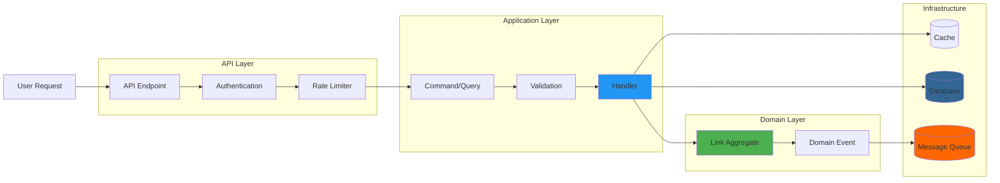
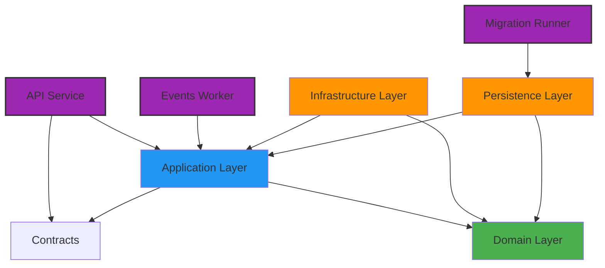
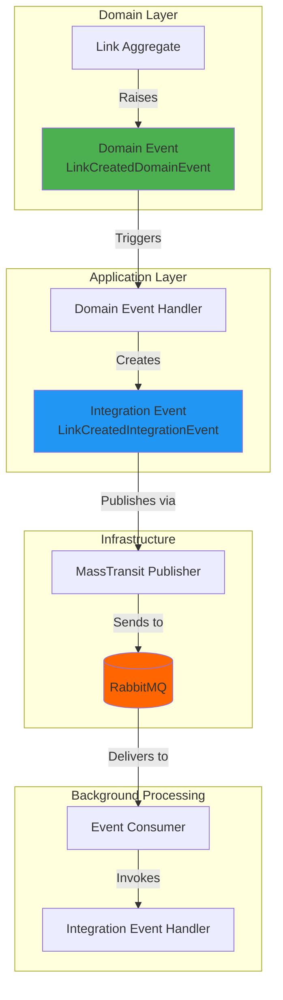
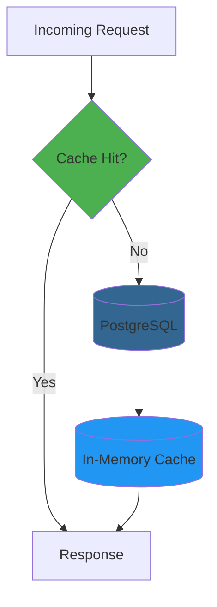

# System Diagrams

This document contains comprehensive system diagrams illustrating the architecture of the offnd.at backend system.

## Component Diagram

The Component diagram shows the internal structure of the offnd.at backend system:

```mermaid
C4Component
    title Component Diagram - offnd.at Backend

    Container_Boundary(api, "API Service") {
        Component(endpoints, "API Endpoints", "ASP.NET Core Minimal API", "Handles HTTP requests")
        Component(middleware, "Middleware Pipeline", "ASP.NET Core", "Authentication, rate limiting, exception handling")
    }
    
    Container_Boundary(worker, "Events Worker") {
        Component(consumers, "Event Consumers", "MassTransit", "Processes integration events")
    }
    
    Container_Boundary(migrator, "Migration Runner") {
        Component(migrations, "Migration Orchestrator", "EF Core", "Applies database migrations")
    }
    
    Container_Boundary(application, "Application Layer") {
        Component(commands, "Command Handlers", "MediatR", "Executes write operations")
        Component(queries, "Query Handlers", "MediatR", "Executes read operations")
        Component(domainEventHandlers, "Domain Event Handlers", "MediatR", "Reacts to domain events")
        Component(validators, "Validators", "FluentValidation", "Validates requests")
    }
    
    Container_Boundary(domain, "Domain Layer") {
        Component(entities, "Entities & Aggregates", "C#", "Link aggregate root")
        Component(valueObjects, "Value Objects", "C#", "Phrase, Url, etc.")
        Component(domainEvents, "Domain Events", "C#", "LinkCreated, LinkVisited")
        Component(repoInterfaces, "Repository Interfaces", "C#", "ILinkRepository")
    }
    
    Container_Boundary(infrastructure, "Infrastructure Layer") {
        Component(messaging, "Messaging", "MassTransit", "RabbitMQ integration")
        Component(caching, "Caching", "IMemoryCache", "In-memory cache")
        Component(telemetry, "Telemetry", "OpenTelemetry", "Metrics, traces, logs")
        Component(resilience, "Resilience", "Polly", "Retry policies")
        Component(phraseGen, "Phrase Generator", "Custom", "Generates profane phrases")
    }
    
    Container_Boundary(persistence, "Persistence Layer") {
        Component(dbContext, "DbContext", "EF Core", "Database context")
        Component(repositories, "Repositories", "EF Core", "Data access implementations")
        Component(configurations, "Entity Configurations", "EF Core", "Entity mappings")
    }
    
    ContainerDb(db, "PostgreSQL", "Database", "Stores links")
    ContainerQueue(mq, "RabbitMQ", "Message Broker", "Event queue")
    
    Rel(endpoints, middleware, "Uses")
    Rel(endpoints, commands, "Sends commands")
    Rel(endpoints, queries, "Sends queries")
    
    Rel(consumers, domainEventHandlers, "Triggers")
    
    Rel(migrations, dbContext, "Uses")
    
    Rel(commands, validators, "Validates with")
    Rel(commands, entities, "Creates/Updates")
    Rel(commands, repoInterfaces, "Uses")
    Rel(commands, phraseGen, "Uses")
    
    Rel(queries, repoInterfaces, "Uses")
    
    Rel(domainEventHandlers, messaging, "Publishes to")
    
    Rel(entities, domainEvents, "Raises")
    Rel(entities, valueObjects, "Contains")
    
    Rel(repositories, dbContext, "Uses")
    Rel(repositories, repoInterfaces, "Implements")
    
    Rel(dbContext, db, "Reads/Writes", "TCP")
    Rel(messaging, mq, "Publishes/Consumes", "AMQP")
    
    UpdateLayoutConfig($c4ShapeInRow="3", $c4BoundaryInRow="1")
```

## Data Flow Diagram

## Layer Dependencies

## Event-Driven Architecture Flow

## Caching Strategy

## Diagram Legend

### Component Types

| Symbol | Meaning |
|--------|---------|
| 🟢 Green | Domain/Core Layer |
| 🔵 Blue | Application Layer |
| 🟠 Orange | Infrastructure/Persistence |
| 🟣 Purple | Services/Entry Points |
| 🔴 Red | External Systems |

### Relationship Types

| Arrow | Meaning |
|-------|---------|
| `-->` | Dependency/Uses |
| `==>` | Data Flow |
| `-.->` | Async/Event |
| `-->>` | Return/Response |
