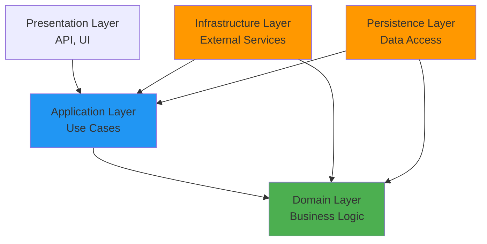

# Clean Architecture Pattern

## Overview

Clean Architecture is an architectural pattern that emphasizes separation of concerns and dependency inversion. The core principle is that **dependencies point inward** toward the business logic, making the system independent of frameworks, UI, databases, and external services.

## Core Principles

### 1. Dependency Rule

**Dependencies must point inward toward the domain.**



### 2. Independence

The business logic should be independent of:
- ❌ Frameworks (ASP.NET, EF Core)
- ❌ UI (Web, Mobile, Desktop)
- ❌ Database (PostgreSQL, SQL Server)
- ❌ External services (APIs, Message queues)

### 3. Testability

Inner layers can be tested without outer layers:
- Domain logic: No dependencies required
- Application logic: Mock repositories and services
- Infrastructure: Integration tests with real dependencies

## Layer Responsibilities

### Domain Layer

**Location**: `OffndAt.Domain`

**Purpose**: Contains core business logic and rules

**Contents**:
- Entities and Aggregate Roots
- Value Objects
- Domain Events
- Repository Interfaces
- Domain Services
- Enumerations

**Dependencies**: **NONE** (pure C#)

**Example**:
```csharp
namespace OffndAt.Domain.Entities;

public sealed class Link : AggregateRoot<LinkId>
{
    public Phrase Phrase { get; }
    public Url TargetUrl { get; }
    public Language Language { get; }
    public Theme Theme { get; }
    
    public static Link Create(Phrase phrase, Url targetUrl, Language language, Theme theme)
    {
        var link = new Link(phrase, targetUrl, language, theme);
        link.RaiseDomainEvent(new LinkCreatedDomainEvent(link.Id, link.Language, link.Theme));
        return link;
    }
}
```

### Application Layer

**Location**: `OffndAt.Application`

**Purpose**: Orchestrates business workflows and use cases

**Contents**:
- CQRS Commands and Queries
- Command/Query Handlers
- Domain Event Handlers
- Application Services
- Validation Rules
- DTOs and Mapping

**Dependencies**: Domain Layer

**Example**:
```csharp
namespace OffndAt.Application.Links.Commands.GenerateLink;

internal sealed class GenerateLinkCommandHandler(
    ILinkRepository linkRepository,
    IPhraseGenerator phraseGenerator)
    : ICommandHandler<GenerateLinkCommand, GenerateLinkResponse>
{
    public async Task<Result<GenerateLinkResponse>> Handle(
        GenerateLinkCommand request,
        CancellationToken cancellationToken)
    {
        // Orchestrate business logic
        var phraseResult = await phraseGenerator.GenerateAsync(/* ... */);
        var link = Link.Create(phraseResult.Value, /* ... */);
        linkRepository.Insert(link);
        
        return Result.Success(new GenerateLinkResponse { /* ... */ });
    }
}
```

### Infrastructure Layer

**Location**: `OffndAt.Infrastructure`

**Purpose**: Implements external service integrations

**Contents**:
- Messaging (MassTransit/RabbitMQ)
- Logging (Serilog)
- Telemetry (OpenTelemetry)
- Caching
- Authentication
- External API clients

**Dependencies**: Application Layer, Domain Layer

**Example**:
```csharp
namespace OffndAt.Infrastructure.Phrases;

internal sealed class PhraseGenerator(IWordRepository wordRepository) : IPhraseGenerator
{
    public async Task<Result<Phrase>> GenerateAsync(
        Format format,
        Language language,
        Theme theme,
        CancellationToken cancellationToken)
    {
        // Implementation using external word repository
        var words = await wordRepository.GetRandomWordsAsync(language, theme, cancellationToken);
        var phraseValue = format.Apply(words);
        return Phrase.Create(phraseValue);
    }
}
```

### Persistence Layer

**Location**: `OffndAt.Persistence`

**Purpose**: Handles data access and storage

**Contents**:
- EF Core DbContext
- Repository Implementations
- Entity Configurations
- Database Migrations

**Dependencies**: Application Layer, Domain Layer

**Example**:
```csharp
namespace OffndAt.Persistence.Repositories;

internal sealed class LinkRepository(OffndAtDbContext context) : ILinkRepository
{
    public async Task<Maybe<Link>> GetByPhraseAsync(
        Phrase phrase,
        CancellationToken cancellationToken = default)
    {
        var link = await context.Links
            .FirstOrDefaultAsync(l => l.Phrase == phrase, cancellationToken);
        
        return link ?? Maybe<Link>.None;
    }
    
    public void Insert(Link link) => context.Links.Add(link);
}
```

### Presentation Layer

**Location**: `OffndAt.Services.Api`

**Purpose**: Exposes the application via HTTP API

**Contents**:
- API Endpoints
- Request/Response DTOs
- Middleware
- API Configuration

**Dependencies**: Application Layer

**Example**:
```csharp
namespace OffndAt.Services.Api.Endpoints.V1;

public sealed class LinksEndpoints : IEndpointDefinition
{
    public void DefineEndpoints(IEndpointRouteBuilder app)
    {
        app.MapPost("/api/v1/links", async (
            GenerateLinkRequest request,
            ISender sender,
            CancellationToken cancellationToken) =>
        {
            var command = new GenerateLinkCommand(/* ... */);
            var result = await sender.Send(command, cancellationToken);
            
            return result.IsSuccess
                ? Results.Created($"/api/v1/links/{result.Value.Phrase}", result.Value)
                : result.ToProblemDetails();
        });
    }
}
```

## Dependency Inversion

### Interface Segregation

Interfaces are defined in the layer that uses them:

```csharp
// Domain layer defines the interface
namespace OffndAt.Domain.Repositories;

public interface ILinkRepository
{
    Task<Maybe<Link>> GetByPhraseAsync(Phrase phrase, CancellationToken cancellationToken = default);
    void Insert(Link link);
}

// Persistence layer implements the interface
namespace OffndAt.Persistence.Repositories;

internal sealed class LinkRepository : ILinkRepository
{
    // Implementation
}
```

### Dependency Injection

Dependencies are injected via constructor:

```csharp
// Application layer depends on abstraction
internal sealed class GenerateLinkCommandHandler(
    ILinkRepository linkRepository,  // Interface from Domain
    IPhraseGenerator phraseGenerator) // Interface from Application
    : ICommandHandler<GenerateLinkCommand, GenerateLinkResponse>
{
    // Handler implementation
}

// Infrastructure provides implementation
services.AddScoped<ILinkRepository, LinkRepository>();
services.AddScoped<IPhraseGenerator, PhraseGenerator>();
```

## Benefits

### ✅ Testability

Test business logic without external dependencies:

```csharp
[Test]
public async Task Handle_ValidCommand_CreatesLink()
{
    // Arrange
    var mockRepository = Substitute.For<ILinkRepository>();
    var mockPhraseGenerator = Substitute.For<IPhraseGenerator>();
    mockPhraseGenerator.GenerateAsync(Arg.Any<Format>(), Arg.Any<Language>(), Arg.Any<Theme>(), Arg.Any<CancellationToken>())
        .Returns(Result.Success(Phrase.Create("test-phrase").Value));
    
    var handler = new GenerateLinkCommandHandler(mockRepository, mockPhraseGenerator);
    var command = new GenerateLinkCommand(/* ... */);
    
    // Act
    var result = await handler.Handle(command, CancellationToken.None);
    
    // Assert
    result.IsSuccess.Should().BeTrue();
    mockRepository.Received(1).Insert(Arg.Any<Link>());
}
```

### ✅ Framework Independence

Switch frameworks without changing business logic:

- Replace EF Core with Dapper
- Replace ASP.NET with gRPC
- Replace PostgreSQL with SQL Server

### ✅ Maintainability

Clear separation of concerns makes code easier to understand and modify:

- Business logic in Domain
- Workflows in Application
- Technical concerns in Infrastructure

### ✅ Flexibility

Easy to add new features or change existing ones:

- Add new commands/queries
- Change external services
- Modify database schema

## Common Pitfalls

### ❌ Leaky Abstractions

**Problem**: Infrastructure concerns leak into domain

```csharp
// BAD: Domain entity depends on EF Core
public class Link
{
    [Key]
    [Column("id")]
    public Guid Id { get; set; }
}

// GOOD: Domain entity is pure
public class Link : AggregateRoot<LinkId>
{
    public LinkId Id { get; }
}
```

### ❌ Anemic Domain Model

**Problem**: Domain entities with no behavior

```csharp
// BAD: Anemic domain
public class Link
{
    public Phrase Phrase { get; set; }
    public Url TargetUrl { get; set; }
}

// GOOD: Rich domain
public class Link : AggregateRoot<LinkId>
{
    public Phrase Phrase { get; }
    public Url TargetUrl { get; }
    
    public static Link Create(Phrase phrase, Url targetUrl, Language language, Theme theme)
    {
        var link = new Link(phrase, targetUrl, language, theme);
        link.RaiseDomainEvent(new LinkCreatedDomainEvent(link.Id, link.Language, link.Theme));
        return link;
    }
}
```

### ❌ Wrong Dependencies

**Problem**: Inner layers depend on outer layers

```csharp
// BAD: Domain depends on Infrastructure
namespace OffndAt.Domain;
using OffndAt.Infrastructure.Messaging;

// GOOD: Infrastructure depends on Domain
namespace OffndAt.Infrastructure.Messaging;
using OffndAt.Domain.Events;
```

## Implementation Checklist

- [ ] Domain layer has no dependencies
- [ ] Application layer depends only on Domain
- [ ] Infrastructure implements interfaces from Domain/Application
- [ ] Presentation layer depends only on Application
- [ ] All dependencies point inward
- [ ] Business logic is testable without external dependencies
- [ ] Repository interfaces defined in Domain
- [ ] Service interfaces defined in Application
- [ ] Dependency injection configured in Presentation

## Related Patterns

- [Domain-Driven Design](./domain-driven-design.md) - Complements Clean Architecture
- [CQRS](./cqrs.md) - Fits naturally in Application layer
- [Repository Pattern](./repository-pattern.md) - Implements data access abstraction
- [Dependency Injection](./dependency-injection.md) - Enables dependency inversion

## Further Reading

- [The Clean Architecture](https://blog.cleancoder.com/uncle-bob/2012/08/13/the-clean-architecture.html) by Robert C. Martin
- [Clean Architecture: A Craftsman's Guide to Software Structure and Design](https://www.amazon.com/Clean-Architecture-Craftsmans-Software-Structure/dp/0134494164) by Robert C. Martin
