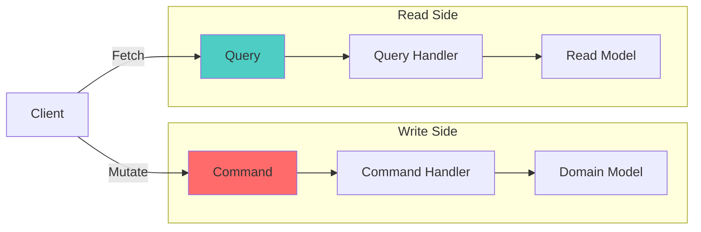
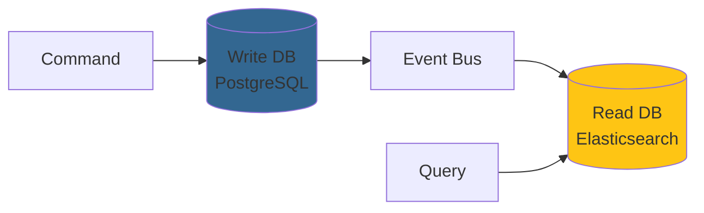

# CQRS (Command Query Responsibility Segregation) Pattern

## Overview

CQRS is a pattern that separates read and write operations into distinct models. Commands change state, queries return data. This separation enables optimization, scalability, and clarity.

## Core Principle

**Separate the model for updating information from the model for reading information.**



## Implementation in offnd.at

### Commands

Commands represent write operations that change system state:

```csharp
namespace OffndAt.Application.Links.Commands.GenerateLink;

public sealed class GenerateLinkCommand(
    string targetUrl,
    int languageId,
    int themeId,
    int formatId) : ICommand<GenerateLinkResponse>
{
    public string TargetUrl { get; } = targetUrl;
    public int LanguageId { get; } = languageId;
    public int ThemeId { get; } = themeId;
    public int FormatId { get; } = formatId;
}
```

**Characteristics**:
- Named with imperative verbs (Generate, Create, Update, Delete)
- Contain all data needed for the operation
- Return `Result<T>` or `Result`
- May trigger side effects (events, notifications)

### Command Handlers

Execute business logic for commands:

```csharp
internal sealed class GenerateLinkCommandHandler(
    ILinkRepository linkRepository,
    IPhraseGenerator phraseGenerator,
    IUrlMaker urlMaker,
    ResiliencePipelineProvider<string> resiliencePipelineProvider,
    ILogger<GenerateLinkCommandHandler> logger)
    : ICommandHandler<GenerateLinkCommand, GenerateLinkResponse>
{
    public async Task<Result<GenerateLinkResponse>> Handle(
        GenerateLinkCommand request,
        CancellationToken cancellationToken)
    {
        // 1. Validate input
        var targetUrlResult = Url.Create(request.TargetUrl);
        if (targetUrlResult.IsFailure)
            return Result.Failure<GenerateLinkResponse>(targetUrlResult.Error);
        
        // 2. Generate unique phrase with retry
        var phraseResult = await GenerateUniquePhraseAsync(/* ... */);
        if (phraseResult.IsFailure)
            return Result.Failure<GenerateLinkResponse>(phraseResult.Error);
        
        // 3. Create domain entity
        var link = Link.Create(phraseResult.Value, targetUrlResult.Value, language, theme);
        linkRepository.Insert(link);
        
        // 4. Return response
        return Result.Success(new GenerateLinkResponse { /* ... */ });
    }
}
```

### Queries

Queries represent read operations that return data:

```csharp
namespace OffndAt.Application.Links.Queries.GetLinkByPhrase;

public sealed record GetLinkByPhraseQuery(string Phrase) : IQuery<LinkResponse>;
```

**Characteristics**:
- Named with nouns (Get, Fetch, Find, List)
- No side effects (idempotent)
- Return DTOs, not domain entities
- Can be optimized independently

### Query Handlers

Retrieve and transform data:

```csharp
internal sealed class GetLinkByPhraseQueryHandler(
    ILinkRepository linkRepository)
    : IQueryHandler<GetLinkByPhraseQuery, LinkResponse>
{
    public async Task<Result<LinkResponse>> Handle(
        GetLinkByPhraseQuery request,
        CancellationToken cancellationToken)
    {
        var phraseResult = Phrase.Create(request.Phrase);
        if (phraseResult.IsFailure)
            return Result.Failure<LinkResponse>(phraseResult.Error);
        
        var maybeLinkResult = await linkRepository.GetByPhraseAsync(phraseResult.Value, cancellationToken);
        if (maybeLinkResult.HasNoValue)
            return Result.Failure<LinkResponse>(DomainErrors.Link.NotFound);
        
        var link = maybeLinkResult.Value;
        return Result.Success(new LinkResponse
        {
            Phrase = link.Phrase,
            TargetUrl = link.TargetUrl,
            Language = link.Language.Name,
            Theme = link.Theme.Name
        });
    }
}
```

## MediatR Integration

### Command Interface

```csharp
public interface ICommand : IRequest<Result>;

public interface ICommand<TResponse> : IRequest<Result<TResponse>>;
```

### Query Interface

```csharp
public interface IQuery<TResponse> : IRequest<Result<TResponse>>;
```

### Handler Interfaces

```csharp
public interface ICommandHandler<in TCommand> : IRequestHandler<TCommand, Result>
    where TCommand : ICommand;

public interface ICommandHandler<in TCommand, TResponse> : IRequestHandler<TCommand, Result<TResponse>>
    where TCommand : ICommand<TResponse>;

public interface IQueryHandler<in TQuery, TResponse> : IRequestHandler<TQuery, Result<TResponse>>
    where TQuery : IQuery<TResponse>;
```

### Sending Commands/Queries

```csharp
// In API endpoint
public static async Task<IResult> GenerateLink(
    GenerateLinkRequest request,
    ISender sender,
    CancellationToken cancellationToken)
{
    var command = new GenerateLinkCommand(
        request.TargetUrl,
        request.LanguageId,
        request.ThemeId,
        request.FormatId);
    
    var result = await sender.Send(command, cancellationToken);
    
    return result.IsSuccess
        ? Results.Created($"/api/v1/links/{result.Value.Phrase}", result.Value)
        : result.ToProblemDetails();
}
```

## Pipeline Behaviors

### Validation Behavior

Automatically validates commands and queries:

```csharp
public sealed class ValidationBehavior<TRequest, TResponse>(
    IEnumerable<IValidator<TRequest>> validators)
    : IPipelineBehavior<TRequest, TResponse>
    where TRequest : IRequest<TResponse>
    where TResponse : Result
{
    public async Task<TResponse> Handle(
        TRequest request,
        RequestHandlerDelegate<TResponse> next,
        CancellationToken cancellationToken)
    {
        if (!validators.Any())
            return await next();
        
        var context = new ValidationContext<TRequest>(request);
        var validationResults = await Task.WhenAll(
            validators.Select(v => v.ValidateAsync(context, cancellationToken)));
        
        var failures = validationResults
            .SelectMany(r => r.Errors)
            .Where(f => f != null)
            .ToList();
        
        if (failures.Count != 0)
            return CreateValidationResult<TResponse>(failures);
        
        return await next();
    }
}
```

### Logging Behavior

Logs all commands and queries:

```csharp
public sealed class LoggingBehavior<TRequest, TResponse>(
    ILogger<LoggingBehavior<TRequest, TResponse>> logger)
    : IPipelineBehavior<TRequest, TResponse>
    where TRequest : IRequest<TResponse>
{
    public async Task<TResponse> Handle(
        TRequest request,
        RequestHandlerDelegate<TResponse> next,
        CancellationToken cancellationToken)
    {
        var requestName = typeof(TRequest).Name;
        
        logger.LogInformation("Handling {RequestName}", requestName);
        var stopwatch = Stopwatch.StartNew();
        
        var response = await next();
        
        stopwatch.Stop();
        logger.LogInformation(
            "Handled {RequestName} in {ElapsedMilliseconds}ms",
            requestName,
            stopwatch.ElapsedMilliseconds);
        
        return response;
    }
}
```

## Benefits

### ✅ Separation of Concerns

Commands and queries have different responsibilities:
- **Commands**: Validate, enforce business rules, change state
- **Queries**: Retrieve and transform data efficiently

### ✅ Optimization

Optimize reads and writes independently:

```csharp
// Write: Use domain model with full validation
public async Task<Result> Handle(GenerateLinkCommand command)
{
    var link = Link.Create(/* ... */);  // Full domain model
    _repository.Insert(link);
}

// Read: Use optimized query
public async Task<Result<LinkResponse>> Handle(GetLinkByPhraseQuery query)
{
    // Could use Dapper for raw SQL, denormalized views, etc.
    return await _repository.GetByPhraseAsync(query.Phrase);
}
```

### ✅ Scalability

Scale reads and writes independently:
- Read replicas for queries
- Primary database for commands
- Separate services if needed

### ✅ Clarity

Clear intent from naming:
- `GenerateLinkCommand` - Creates a link
- `GetLinkByPhraseQuery` - Retrieves a link

## Advanced Patterns

### Event Sourcing (Future)

Commands create events, queries read from projections:

```csharp
// Command creates events
public async Task Handle(GenerateLinkCommand command)
{
    var events = new[]
    {
        new LinkCreatedEvent(/* ... */),
        new PhraseGeneratedEvent(/* ... */)
    };
    
    await _eventStore.AppendAsync(events);
}

// Query reads from projection
public async Task<Result<LinkResponse>> Handle(GetLinkByPhraseQuery query)
{
    return await _readModel.GetByPhraseAsync(query.Phrase);
}
```

### Separate Read/Write Databases



## Common Pitfalls

### ❌ Queries with Side Effects

```csharp
// BAD: Query modifies state
public async Task<Result<LinkResponse>> Handle(GetLinkByPhraseQuery query)
{
    var link = await _repository.GetByPhraseAsync(query.Phrase);
    link.RecordVisit();  // ❌ Side effect in query!
    return MapToResponse(link);
}

// GOOD: Separate command for side effects
public async Task<Result<LinkResponse>> Handle(GetLinkByPhraseQuery query)
{
    var link = await _repository.GetByPhraseAsync(query.Phrase);
    return MapToResponse(link);  // ✅ No side effects
}
```

### ❌ Returning Domain Entities from Queries

```csharp
// BAD: Exposing domain entities
public interface IQuery<Link> { }

// GOOD: Return DTOs
public interface IQuery<LinkResponse> { }
```

## Testing

### Command Handler Tests

```csharp
[Test]
public async Task Handle_ValidCommand_CreatesLink()
{
    // Arrange
    var mockRepository = Substitute.For<ILinkRepository>();
    var handler = new GenerateLinkCommandHandler(mockRepository, /* ... */);
    var command = new GenerateLinkCommand(/* ... */);
    
    // Act
    var result = await handler.Handle(command, CancellationToken.None);
    
    // Assert
    result.IsSuccess.Should().BeTrue();
    mockRepository.Received(1).Insert(Arg.Any<Link>());
}
```

### Query Handler Tests

```csharp
[Test]
public async Task Handle_ExistingPhrase_ReturnsLink()
{
    // Arrange
    var mockRepository = Substitute.For<ILinkRepository>();
    var link = CreateTestLink();
    mockRepository.GetByPhraseAsync(Arg.Any<Phrase>())
        .Returns(Maybe<Link>.From(link));
    
    var handler = new GetLinkByPhraseQueryHandler(mockRepository);
    var query = new GetLinkByPhraseQuery("test-phrase");
    
    // Act
    var result = await handler.Handle(query, CancellationToken.None);
    
    // Assert
    result.IsSuccess.Should().BeTrue();
    result.Value.Phrase.Should().Be("test-phrase");
}
```

## Related Patterns

- [Clean Architecture](./clean-architecture.md) - CQRS fits in Application layer
- [Event-Driven Architecture](./event-driven-architecture.md) - Commands trigger events
- [Repository Pattern](./repository-pattern.md) - Data access for commands/queries
- [Result Pattern](./result-pattern.md) - Error handling for commands/queries

## Further Reading

- [CQRS](https://martinfowler.com/bliki/CQRS.html) by Martin Fowler
- [CQRS Documents](https://cqrs.files.wordpress.com/2010/11/cqrs_documents.pdf) by Greg Young
