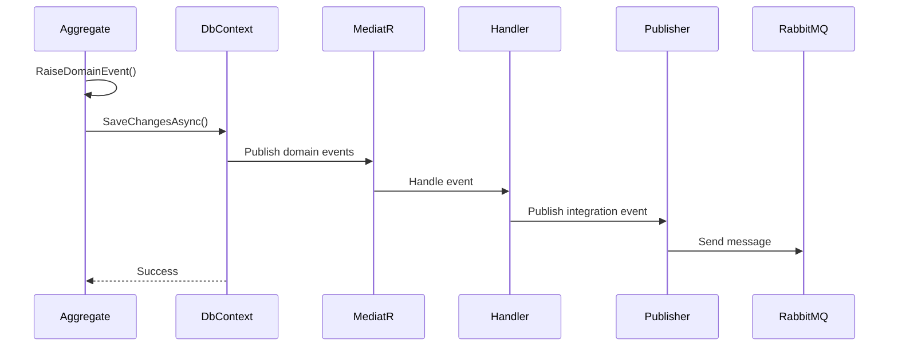
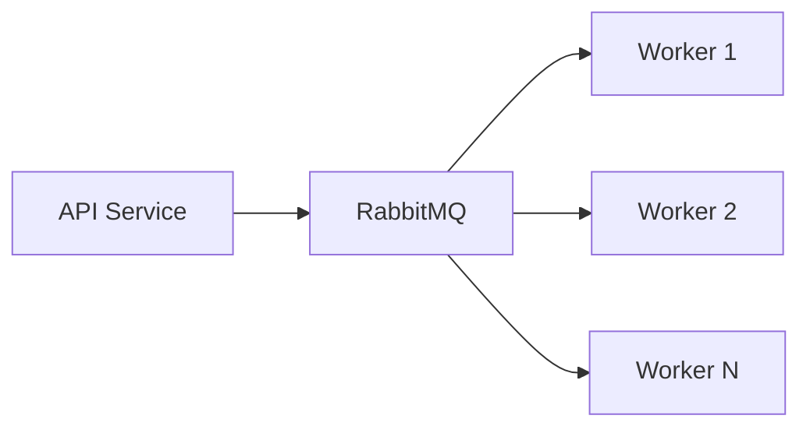

# Event-Driven Architecture Pattern

## Overview

Event-Driven Architecture (EDA) is a pattern where components communicate through events. Events represent something that has happened in the system, enabling loose coupling and asynchronous processing.

## Event Types

### 1. Domain Events

**Purpose**: Capture domain occurrences within the same bounded context

**Characteristics**:
- Handled synchronously within the same transaction
- Published via MediatR
- Defined in Domain layer
- Trigger side effects within the domain

**Example**:
```csharp
namespace OffndAt.Domain.Events;

public sealed record LinkCreatedDomainEvent(LinkId LinkId, Language Language, Theme Theme) : IDomainEvent;

public sealed record LinkVisitedDomainEvent(LinkId LinkId, LinkVisitedContext Context) : IDomainEvent;
```

### 2. Integration Events

**Purpose**: Cross-service communication via message bus

**Characteristics**:
- Handled asynchronously
- Published to RabbitMQ via MassTransit
- Defined in Contracts layer
- Enable eventual consistency

**Example**:
```csharp
namespace OffndAt.Contracts.Links.IntegrationEvents;

public sealed record LinkCreatedIntegrationEvent
{
    public Guid LinkId { get; init; }
    public string Phrase { get; init; } = string.Empty;
    public int LanguageId { get; init; }
    public int ThemeId { get; init; }
    public DateTime CreatedAtUtc { get; init; }
}
```

## Domain Events Flow



## Implementation

### Raising Domain Events

```csharp
public sealed class Link : AggregateRoot<LinkId>
{
    public static Link Create(Phrase phrase, Url targetUrl, Language language, Theme theme)
    {
        var link = new Link(phrase, targetUrl, language, theme);
        
        // Raise domain event
        link.RaiseDomainEvent(new LinkCreatedDomainEvent(link.Id, link.Language, link.Theme));
        
        return link;
    }
    
    public void RecordVisit()
    {
        RaiseDomainEvent(new LinkVisitedDomainEvent(Id, new LinkVisitedContext(Language, Theme, DateTimeOffset.UtcNow)));
    }
}
```

### Aggregate Root Base Class

```csharp
public abstract class AggregateRoot<TEntityId> : SoftDeletableEntity<TEntityId>, IAggregateRoot 
    where TEntityId : EntityId
{
    private readonly List<IDomainEvent> _domainEvents = [];
    
    public IReadOnlyCollection<IDomainEvent> DomainEvents => _domainEvents.AsReadOnly();
    
    public void RaiseDomainEvent(IDomainEvent domainEvent) => _domainEvents.Add(domainEvent);
    
    public void ClearDomainEvents() => _domainEvents.Clear();
}
```

### Publishing Domain Events

```csharp
public sealed class OffndAtDbContext : DbContext
{
    private readonly IPublisher _publisher;
    
    public OffndAtDbContext(DbContextOptions<OffndAtDbContext> options, IPublisher publisher)
        : base(options)
    {
        _publisher = publisher;
    }
    
    public override async Task<int> SaveChangesAsync(CancellationToken cancellationToken = default)
    {
        // Get domain events before saving
        var domainEvents = ChangeTracker.Entries<IAggregateRoot>()
            .SelectMany(entry => entry.Entity.DomainEvents)
            .ToList();
        
        // Save changes
        var result = await base.SaveChangesAsync(cancellationToken);
        
        // Publish domain events after successful save
        foreach (var domainEvent in domainEvents)
        {
            await _publisher.Publish(domainEvent, cancellationToken);
        }
        
        // Clear domain events
        ChangeTracker.Entries<IAggregateRoot>()
            .ToList()
            .ForEach(entry => entry.Entity.ClearDomainEvents());
        
        return result;
    }
}
```

### Domain Event Handlers

```csharp
namespace OffndAt.Application.Links.DomainEventHandlers;

internal sealed class LinkCreatedDomainEventHandler(
    IPublishEndpoint publishEndpoint,
    ILogger<LinkCreatedDomainEventHandler> logger)
    : IDomainEventHandler<LinkCreatedDomainEvent>
{
    public async Task Handle(LinkCreatedDomainEvent notification, CancellationToken cancellationToken)
    {
        logger.LogInformation("Link created: {LinkId}", notification.LinkId);
        
        // Publish integration event to RabbitMQ
        await publishEndpoint.Publish(
            new LinkCreatedIntegrationEvent
            {
                LinkId = notification.LinkId.Value,
                LanguageId = notification.Language.Value,
                ThemeId = notification.Theme.Value,
                CreatedAtUtc = DateTime.UtcNow
            },
            cancellationToken);
    }
}
```

## Integration Events

### Publishing Integration Events

```csharp
// Via domain event handler (shown above)
await publishEndpoint.Publish(new LinkCreatedIntegrationEvent { /* ... */ }, cancellationToken);

// Or directly from application service
await _publishEndpoint.Publish(new LinkVisitedIntegrationEvent { /* ... */ }, cancellationToken);
```

### Consuming Integration Events

```csharp
namespace OffndAt.Services.EventsWorker.Consumers;

public sealed class LinkCreatedIntegrationEventConsumer(
    ILogger<LinkCreatedIntegrationEventConsumer> logger)
    : IConsumer<LinkCreatedIntegrationEvent>
{
    public async Task Consume(ConsumeContext<LinkCreatedIntegrationEvent> context)
    {
        var @event = context.Message;
        
        logger.LogInformation(
            "Processing LinkCreatedIntegrationEvent for link {LinkId}",
            @event.LinkId);
        
        // Process the event (e.g., update analytics, send notifications)
        await ProcessLinkCreatedAsync(@event);
    }
    
    private async Task ProcessLinkCreatedAsync(LinkCreatedIntegrationEvent @event)
    {
        // Business logic for handling link creation
        await Task.CompletedTask;
    }
}
```

### MassTransit Configuration

```csharp
services.AddMassTransit(x =>
{
    // Register consumers
    x.AddConsumers(typeof(LinkCreatedIntegrationEventConsumer).Assembly);
    
    x.UsingRabbitMq((context, cfg) =>
    {
        cfg.Host(settings.Host, settings.VirtualHost, h =>
        {
            h.Username(settings.Username);
            h.Password(settings.Password);
        });
        
        // Retry policy
        cfg.UseMessageRetry(r => r.Incremental(
            retryLimit: 3,
            initialInterval: TimeSpan.FromSeconds(1),
            intervalIncrement: TimeSpan.FromSeconds(2)));
        
        // Configure endpoints
        cfg.ConfigureEndpoints(context);
    });
});
```

## Event Patterns

### Event Notification

Simple notification that something happened:

```csharp
public sealed record LinkVisitedNotification(LinkId LinkId, DateTimeOffset VisitedAt) : INotification;

// Handler
internal sealed class LinkVisitedNotificationHandler : INotificationHandler<LinkVisitedNotification>
{
    public async Task Handle(LinkVisitedNotification notification, CancellationToken cancellationToken)
    {
        // Record metrics, update cache, etc.
    }
}
```

### Event Sourcing (Future Pattern)

Store events as the source of truth:

```csharp
public sealed record LinkCreatedEvent(Guid LinkId, string Phrase, string TargetUrl, DateTime CreatedAt);
public sealed record LinkVisitedEvent(Guid LinkId, DateTime VisitedAt);

// Event store
public interface IEventStore
{
    Task AppendAsync<TEvent>(TEvent @event, CancellationToken cancellationToken) where TEvent : class;
    IAsyncEnumerable<object> GetEventsAsync(Guid aggregateId);
}

// Rebuild state from events
public static Link FromEvents(IEnumerable<object> events)
{
    Link? link = null;
    
    foreach (var @event in events)
    {
        link = @event switch
        {
            LinkCreatedEvent e => new Link(e.LinkId, e.Phrase, e.TargetUrl),
            LinkVisitedEvent e => link!.RecordVisit(e.VisitedAt),
            _ => link
        };
    }
    
    return link!;
}
```

## Benefits

### ✅ Loose Coupling

Components don't need to know about each other:

```csharp
// Link aggregate doesn't know about analytics
link.RaiseDomainEvent(new LinkCreatedDomainEvent(link.Id));

// Analytics service reacts to event
public class AnalyticsHandler : IDomainEventHandler<LinkCreatedDomainEvent>
{
    public async Task Handle(LinkCreatedDomainEvent notification)
    {
        // Update analytics
    }
}
```

### ✅ Scalability

Asynchronous processing enables horizontal scaling:



### ✅ Extensibility

Add new event handlers without modifying existing code:

```csharp
// Add new handler for existing event
internal sealed class SendEmailOnLinkCreatedHandler : IDomainEventHandler<LinkCreatedDomainEvent>
{
    public async Task Handle(LinkCreatedDomainEvent notification)
    {
        // Send email notification
    }
}
```

### ✅ Audit Trail

Events provide a complete history:

```csharp
// All events are logged
logger.LogInformation("Link created: {LinkId}", @event.LinkId);
logger.LogInformation("Link visited: {LinkId}", @event.LinkId);
```

## Event Ordering

### Within Aggregate

Events are ordered within an aggregate:

```csharp
var link = Link.Create(/* ... */);
// Event 1: LinkCreatedDomainEvent

link.RecordVisit();
// Event 2: LinkVisitedDomainEvent

// Events published in order
```

### Across Aggregates

No guaranteed ordering across different aggregates:

```csharp
// These may be processed in any order
link1.RaiseDomainEvent(new LinkCreatedDomainEvent(link1.Id));
link2.RaiseDomainEvent(new LinkCreatedDomainEvent(link2.Id));
```

## Error Handling

### Retry Policy

```csharp
cfg.UseMessageRetry(r => r.Incremental(
    retryLimit: 3,
    initialInterval: TimeSpan.FromSeconds(1),
    intervalIncrement: TimeSpan.FromSeconds(2)));
```

### Dead Letter Queue

```csharp
cfg.ReceiveEndpoint("link-created-queue", e =>
{
    e.ConfigureConsumer<LinkCreatedIntegrationEventConsumer>(context);
    
    // Dead letter queue for failed messages
    e.UseMessageRetry(r => r.Intervals(100, 500, 1000));
    e.DiscardFaultedMessages(); // Or send to error queue
});
```

## Testing

### Domain Event Tests

```csharp
[Test]
public void Create_RaisesLinkCreatedDomainEvent()
{
    // Arrange & Act
    var link = Link.Create(phrase, targetUrl, language, theme);
    
    // Assert
    link.DomainEvents.Should().ContainSingle()
        .Which.Should().BeOfType<LinkCreatedDomainEvent>()
        .Which.LinkId.Should().Be(link.Id);
}
```

### Integration Event Tests

```csharp
[Test]
public async Task Consume_ValidEvent_ProcessesSuccessfully()
{
    // Arrange
    var consumer = new LinkCreatedIntegrationEventConsumer(logger);
    var @event = new LinkCreatedIntegrationEvent { LinkId = Guid.NewGuid() };
    var context = Substitute.For<ConsumeContext<LinkCreatedIntegrationEvent>>();
    context.Message.Returns(@event);
    
    // Act
    await consumer.Consume(context);
    
    // Assert
    // Verify processing logic
}
```

## Anti-Patterns

### ❌ Synchronous Event Processing

```csharp
// BAD: Blocking on event processing
await _publisher.Publish(domainEvent);
await SaveChangesAsync();  // Waits for all handlers

// GOOD: Fire and forget for integration events
await SaveChangesAsync();  // Publishes domain events
// Integration events published asynchronously to RabbitMQ
```

### ❌ Events with Side Effects in Queries

```csharp
// BAD: Query raising events
public async Task<Link> GetLinkAsync(Phrase phrase)
{
    var link = await _repository.GetByPhraseAsync(phrase);
    link.RaiseDomainEvent(new LinkViewedEvent());  // ❌
    return link;
}

// GOOD: Separate command for side effects
public async Task RecordVisitAsync(LinkId linkId)
{
    var link = await _repository.GetByIdAsync(linkId);
    link.RecordVisit();  // ✅ Raises event
}
```

## Related Patterns

- [Domain-Driven Design](./domain-driven-design.md) - Domain events are DDD building blocks
- [CQRS](./cqrs.md) - Commands trigger events
- [Clean Architecture](./clean-architecture.md) - Events flow through layers

## Further Reading

- [Domain Events: Design and Implementation](https://docs.microsoft.com/en-us/dotnet/architecture/microservices/microservice-ddd-cqrs-patterns/domain-events-design-implementation) by Microsoft
- [Event-Driven Architecture](https://martinfowler.com/articles/201701-event-driven.html) by Martin Fowler
